# DTU - Autonomous Marine Robotics Project

This software repository implements a multi-target tracking systems for marine habor environments.
Our system successfully uses the EKF to fuse camera, radar, and AIS data to handle multi-target tracking via Mahalanobis gating and NN and GNN track assignments. The system has been validated in simulation and on real data. 

You may simulate the different scenarios like this:
## Scenario A
```console
python sim_tracking.py --scenario A --mode radar
```
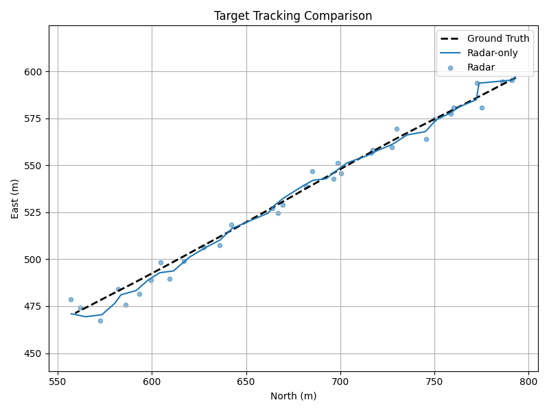
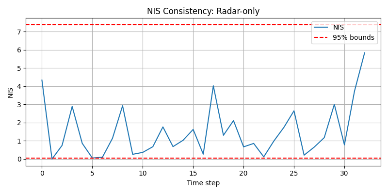
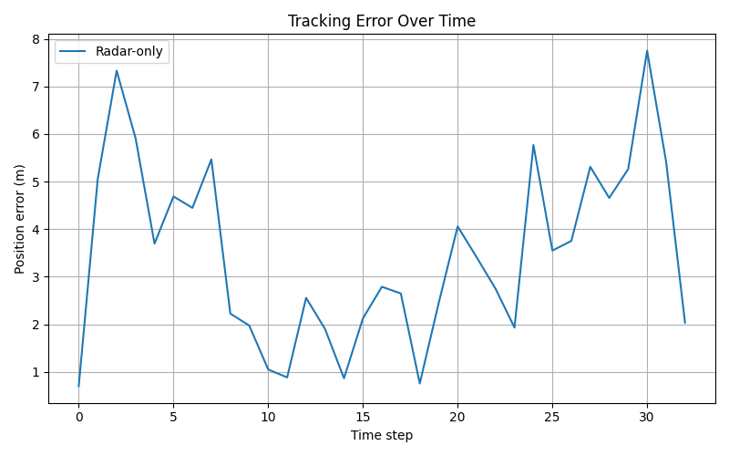
## Scenario B
```console
python sim_tracking.py --scenario B --mode joint
```
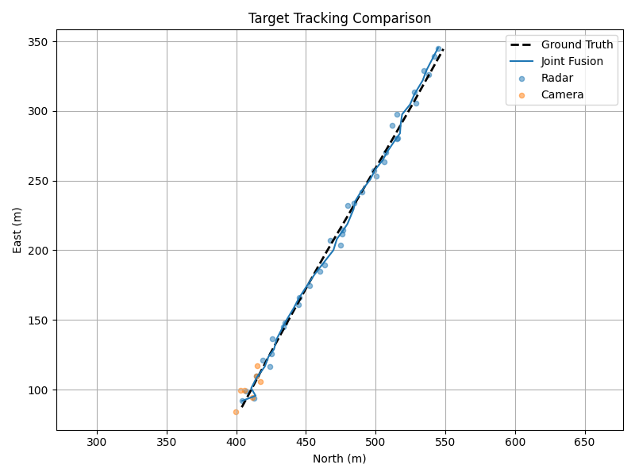
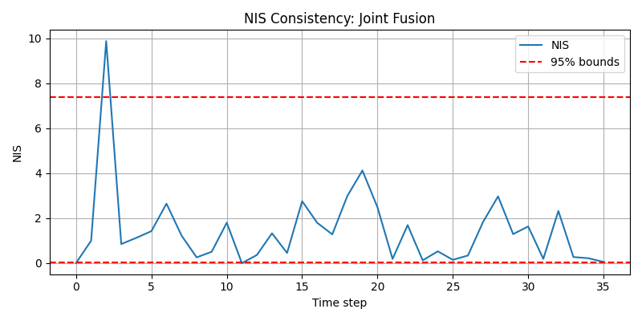
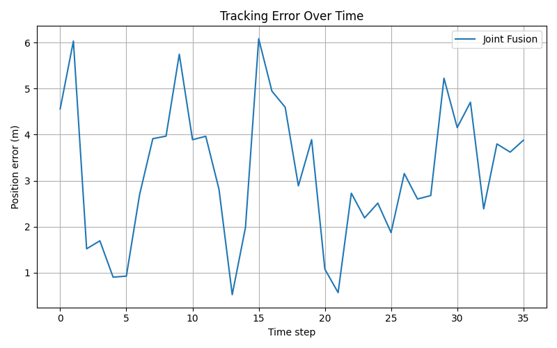
```console
python sim_tracking.py --scenario B --mode sequential
```
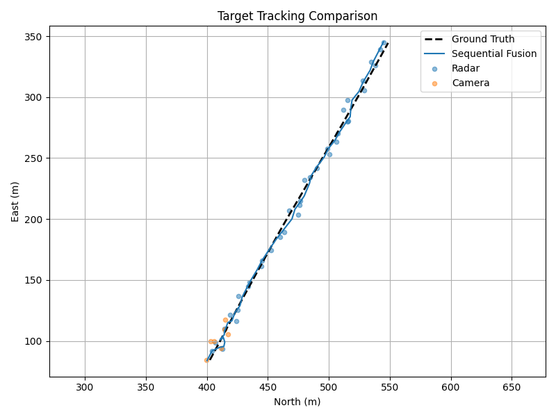
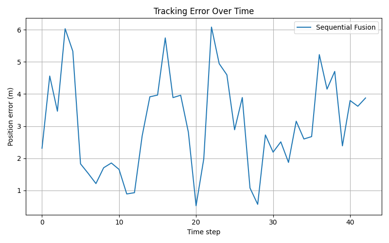
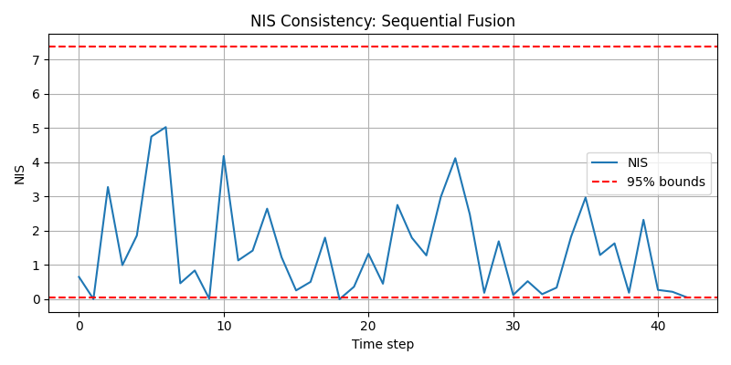
## Scenario C
```console
python sim_tracking.py --scenario C --mode ais
```
or alternatively with mode radar, for comparison
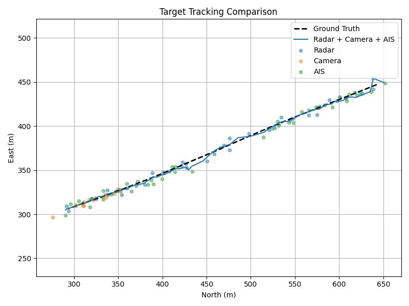
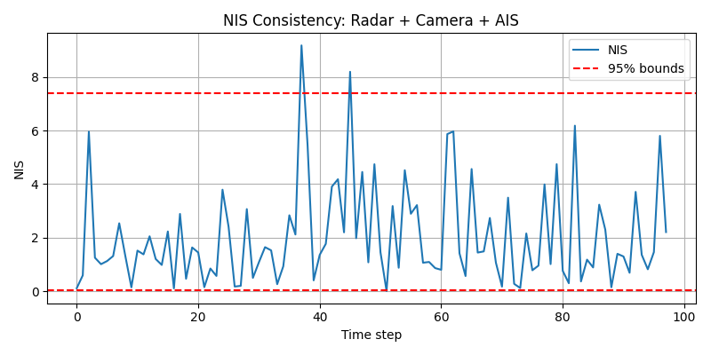
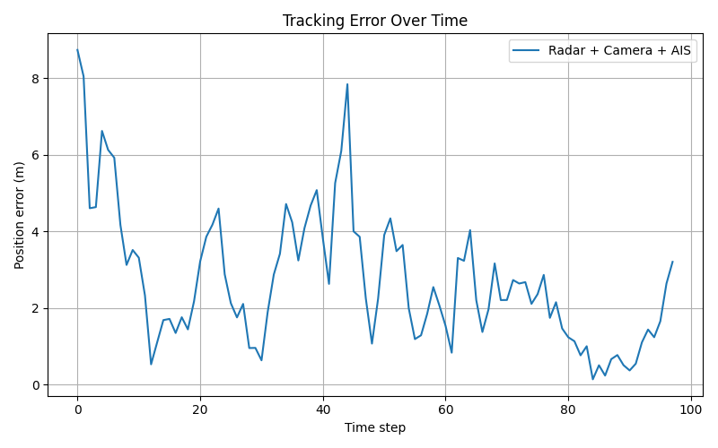
## Scenario D
```console
python sim_tracking.py --scenario D --assoc nn 
```


```text
Simulating Scenario D with mode ais
Association method: NN
Matched updates: radar=177, camera=60
Unmatched detections: radar=129, camera=170
False alarms presented: radar=176, camera=186
Sensor available scans: radar=36, camera=59
Confirmed tracks alive: 4
Coasting tracks alive: 0
Confirmed track promotions: 8
Tracks created=129, created by sensor=(radar=129, camera=0), tentative now=2, deleted=123, merged=0
Track-management metrics:
  MOTP avg: 51.75 m
  CE avg: 0.49
  MOTP/CE matched pairs: 291
Per-target confirmed-track RMSE:
  GT 0: track 34 RMSE [N, E]=[3.26563135 1.9709212 ] total=3.81 m (votes=26, states=26)
  GT 1: track 18 RMSE [N, E]=[1.82460748 2.58746771] total=3.17 m (votes=28, states=28)
  GT 2: track 42 RMSE [N, E]=[4.31602612 2.66360229] total=5.07 m (votes=19, states=19)
  GT 3: track 12 RMSE [N, E]=[3.58684185 1.40659024] total=3.85 m (votes=58, states=59)
Average total RMSE across matched targets: 3.98 m
```

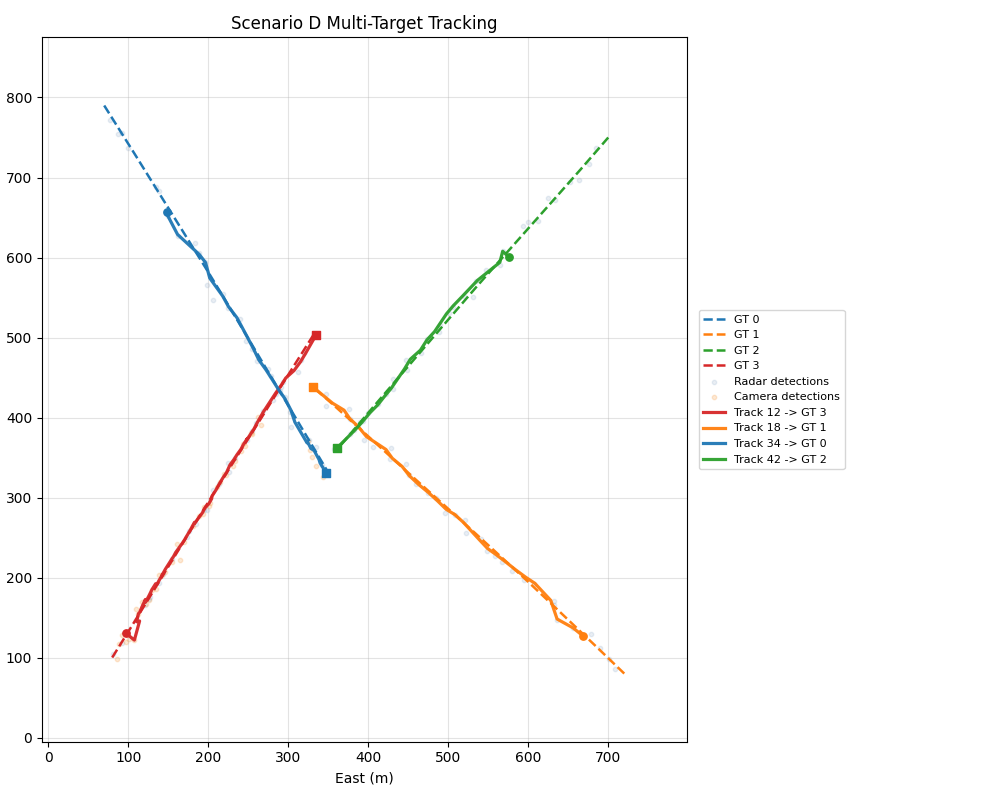
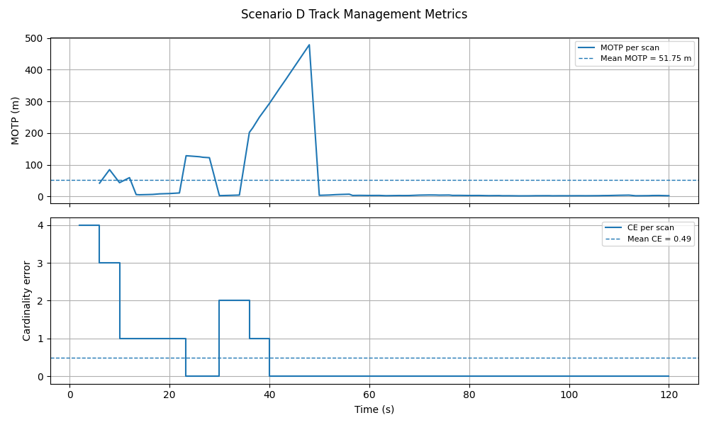


```console
python sim_tracking.py --scenario D --assoc gnn 
```
```text
Simulating Scenario D with mode ais
Association method: GNN
Matched updates: radar=194, camera=55
Unmatched detections: radar=112, camera=175
False alarms presented: radar=176, camera=186
Sensor available scans: radar=36, camera=59
Confirmed tracks alive: 4
Coasting tracks alive: 1
Confirmed track promotions: 7
Tracks created=112, created by sensor=(radar=112, camera=0), tentative now=2, deleted=105, merged=0
Track-management metrics:
  MOTP avg: 4.78 m
  CE avg: 0.63
  MOTP/CE matched pairs: 297
Per-target confirmed-track RMSE:
  GT 0: track 0 RMSE [N, E]=[3.13219748 1.61008654] total=3.52 m (votes=35, states=35)
  GT 1: track 19 RMSE [N, E]=[2.22004403 2.85099865] total=3.61 m (votes=31, states=31)
  GT 2: track 12 RMSE [N, E]=[3.48499794 2.31236641] total=4.18 m (votes=32, states=32)
  GT 3: track 13 RMSE [N, E]=[3.39082317 1.3884731 ] total=3.66 m (votes=61, states=62)
Average total RMSE across matched targets: 3.75 m
```
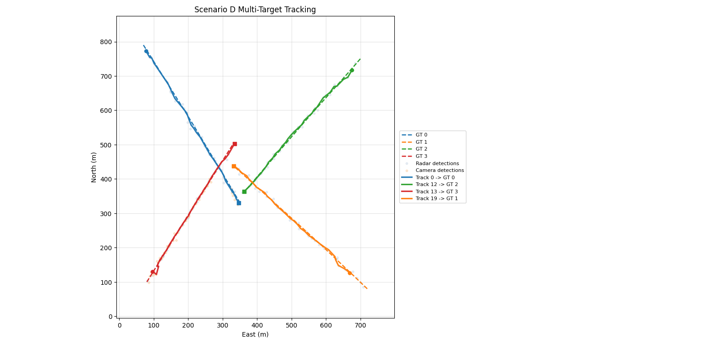
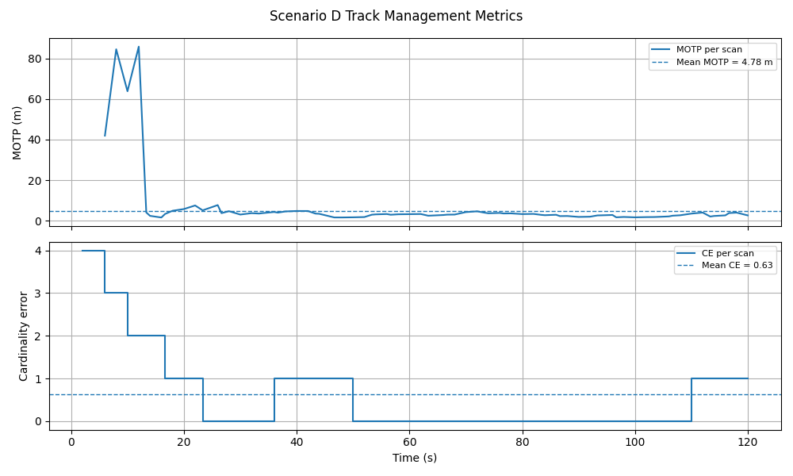
## Scenario E
```console
python sim_tracking.py --scenario E --assoc nn --show-ended-after 20
```
```text
Simulating Scenario E with mode ais
Association method: NN
Matched updates: radar=357, camera=182, ais=167
Unmatched detections: radar=236, camera=235, ais=13
False alarms presented: radar=342, camera=258, ais=10
Sensor available scans: radar=54, camera=89, ais=60
Confirmed tracks alive: 5
Coasting tracks alive: 0
Confirmed track promotions: 9
Tracks created=249, created by sensor=(radar=236, camera=0, ais=13), tentative now=5, deleted=239, merged=0
Track-management metrics:
  MOTP avg: 8.70 m
  CE avg: 0.42
  MOTP/CE matched pairs: 1032
Per-target confirmed-track RMSE:
  GT 0: track 14 RMSE [N, E]=[1.71633357 1.53988998] total=2.31 m (votes=94, states=94)
  GT 1: track 1 RMSE [N, E]=[0.979006   1.90316724] total=2.14 m (votes=165, states=165)
  GT 2: track 55 RMSE [N, E]=[2.16230648 1.51185805] total=2.64 m (votes=80, states=80)
  GT 3: track 32 RMSE [N, E]=[2.93974834 3.82871171] total=4.83 m (votes=39, states=39)
  GT 4: track 3 RMSE [N, E]=[2.74592989 1.81493582] total=3.29 m (votes=44, states=44)
  GT 5: track 101 RMSE [N, E]=[1.85584964 1.50104126] total=2.39 m (votes=79, states=79)
Average total RMSE across matched targets: 2.93 m
```


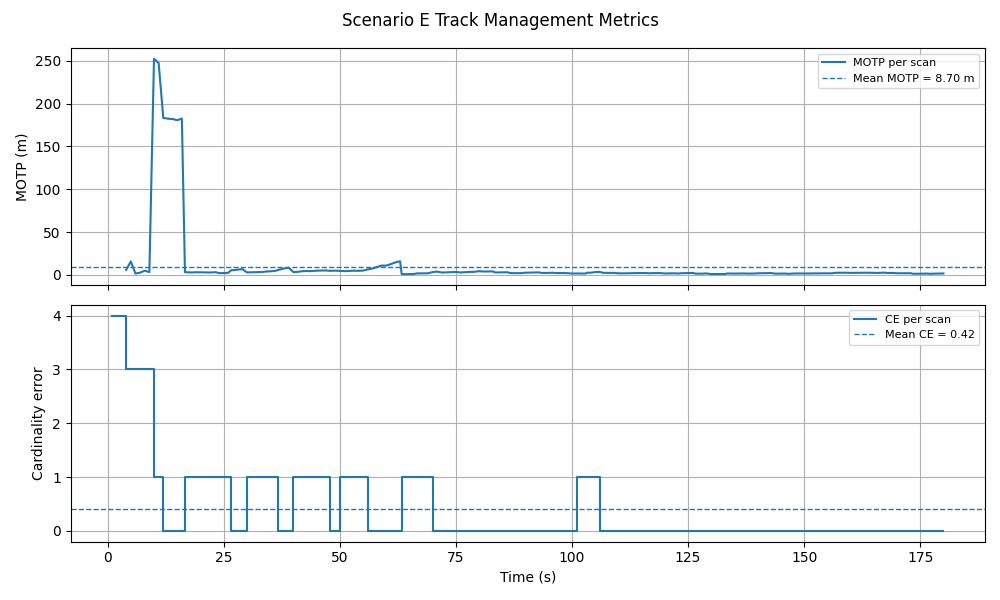

```console
python sim_tracking.py --scenario E --assoc gnn --show-ended-after 20
```

```text
Simulating Scenario E with mode ais
Association method: GNN
Matched updates: radar=374, camera=182, ais=167
Unmatched detections: radar=219, camera=235, ais=13
False alarms presented: radar=342, camera=258, ais=10
Sensor available scans: radar=54, camera=89, ais=60
Confirmed tracks alive: 6
Coasting tracks alive: 0
Confirmed track promotions: 11
Tracks created=232, created by sensor=(radar=219, camera=0, ais=13), tentative now=4, deleted=222, merged=0
Track-management metrics:
  MOTP avg: 8.46 m
  CE avg: 0.50
  MOTP/CE matched pairs: 1036
Per-target confirmed-track RMSE:
  GT 0: track 14 RMSE [N, E]=[1.71353994 1.61226525] total=2.35 m (votes=97, states=97)
  GT 1: track 1 RMSE [N, E]=[1.00739109 2.00754763] total=2.25 m (votes=172, states=172)
  GT 2: track 53 RMSE [N, E]=[2.22876622 1.48586319] total=2.68 m (votes=87, states=87)
  GT 3: track 25 RMSE [N, E]=[2.48221112 3.69538153] total=4.45 m (votes=49, states=49)
  GT 4: track 3 RMSE [N, E]=[2.79132363 1.8081016 ] total=3.33 m (votes=45, states=45)
  GT 5: track 95 RMSE [N, E]=[1.84023529 1.49317952] total=2.37 m (votes=79, states=79)
Average total RMSE across matched targets: 2.90 m
```

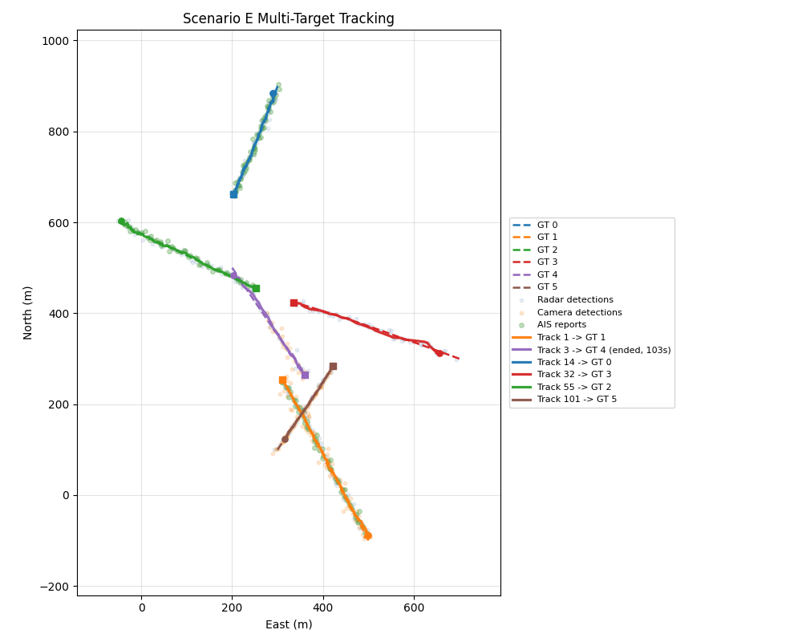
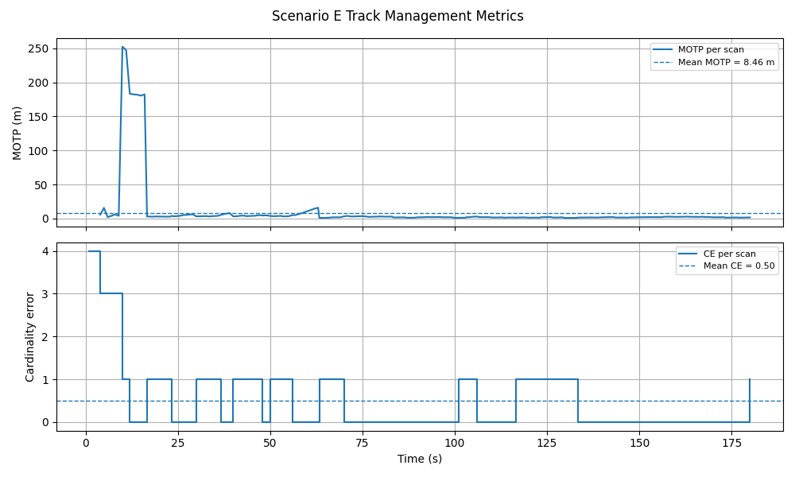

## Real Data 
```console
python run_real_data_tracking.py  
```

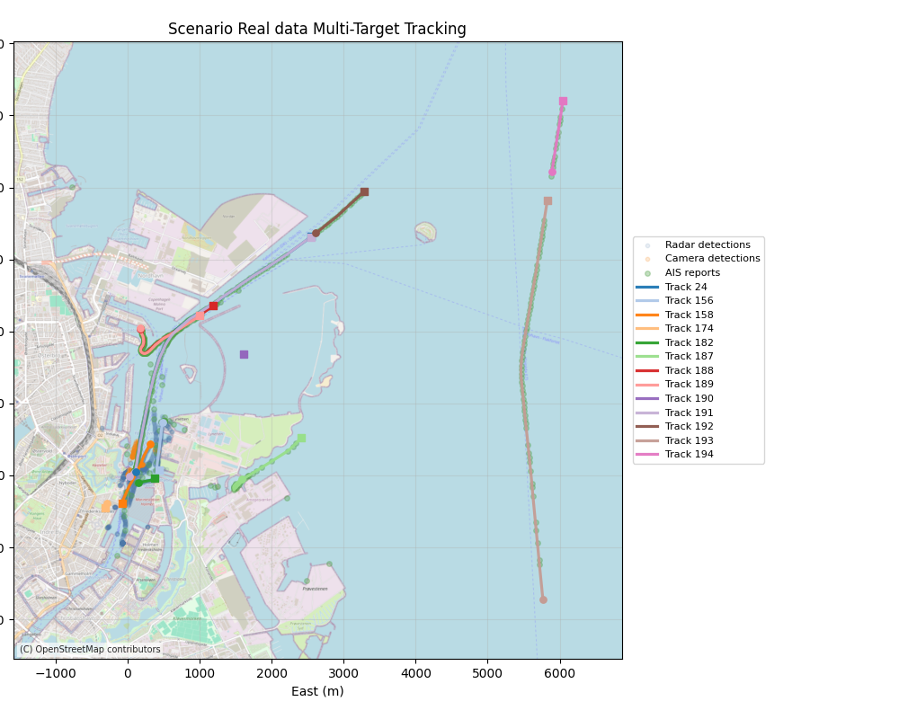
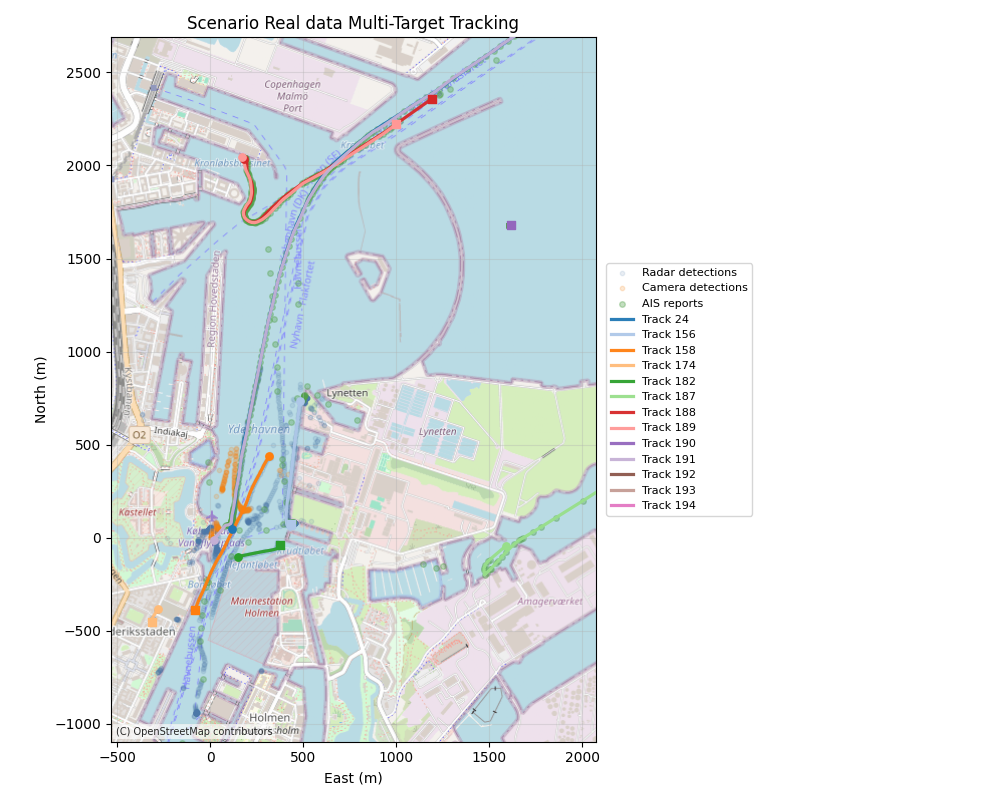